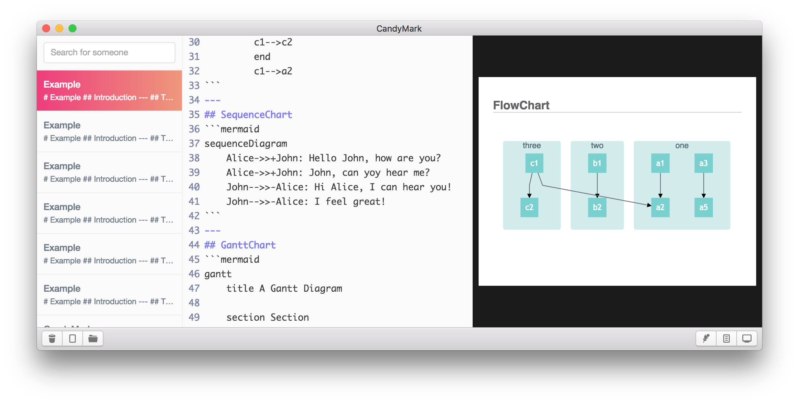

# CandyMark
CandyMark is a simple markdown editor.



## Features
- Live preview
- GitHub Flavored Markdown
- support `mermaid.js`.
- support `Katex.js`.
- support Built-in Database.
- support PDF export.
- Fast Synchronized Scroll.

## Usage
To debug application, enter command below in a terminal.
```sh
npm install
npm start
```
To build application, enter command below in a terminal.
```sh
npm run build
```

## Writing
- `mermaid` code block will render mermaid diagrams.
- `math` code block will render KATeX.

## Roadmap
- presentation support
- export HTML
- file browser
- screenshot

## License
MIT. Copyright (c) @icd428.
