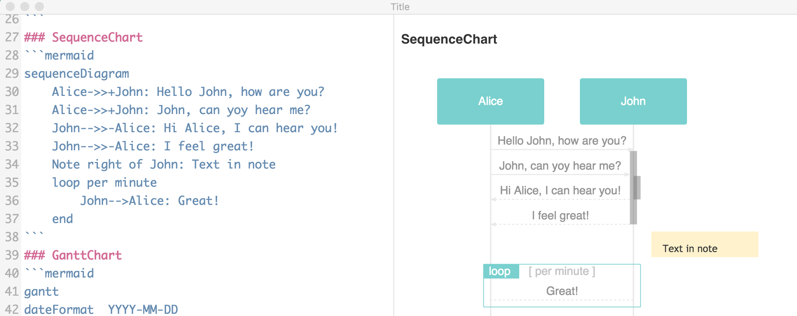

# CandyMark

CandyMark is a simple markdown editor.

## Features
- Live preview
- GitHub Flavored Markdown support
- mermaid.js support
- Katex support

## Screenshot

## Roadmap
- Synchronized Scroll support
- Presentation support

## License
MIT. Copyright (c) Keito Ohsawa.
