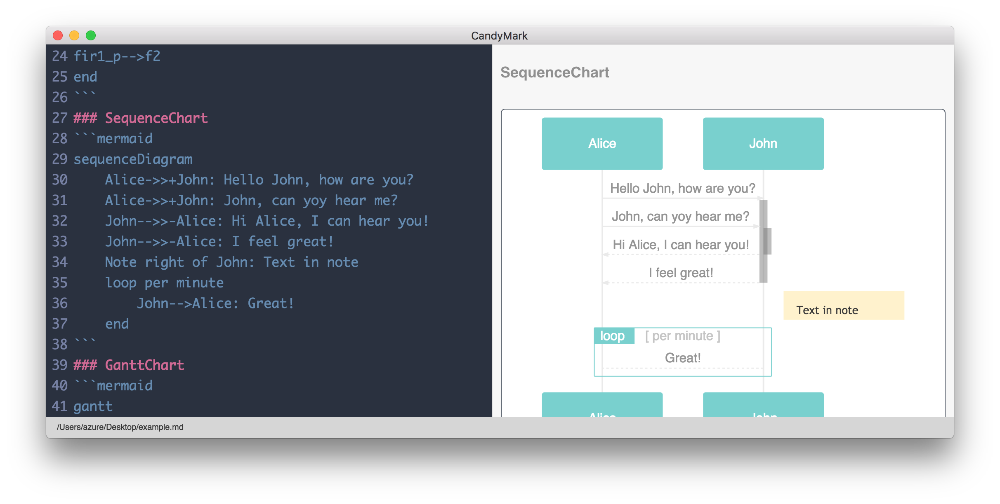

# CandyMark

CandyMark is a simple markdown editor.

## Features
- Live preview
- GitHub Flavored Markdown support
- mermaid.js support
- Katex support

## Screenshot

## Usage
- `mermaid` code block will render mermaid diagrams.
- `math` code block will render KATeX.

## Roadmap
- Synchronized Scroll support
- Presentation support

## License
MIT. Copyright (c) Keito Ohsawa.
